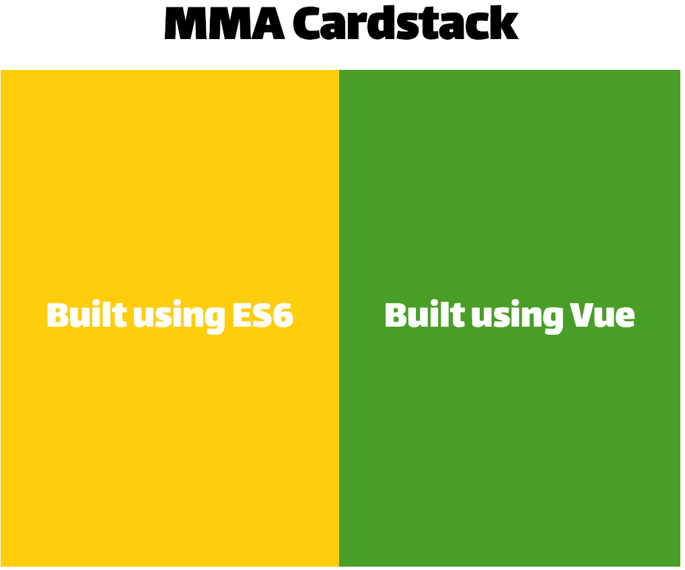
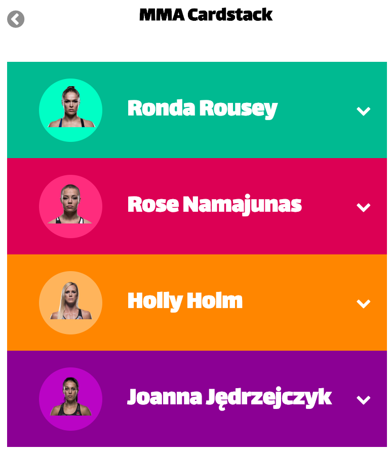

# MMA Cardstack

A simple dropdown card stack featuring my favorite MMA players. I wanted to try building something simple in vanilla javascript. I used ES6 Template String to construct HTML. No jQuery used at all. After I built this, I though it would be interesting to build this in Vue. Vue made it so much easier! 🤩

# Index Page

# Cardstack

## Built using JavaScript

View code [here](scripts/es6.js)

## Built using Vue

View code [here](scripts/vue.js)
